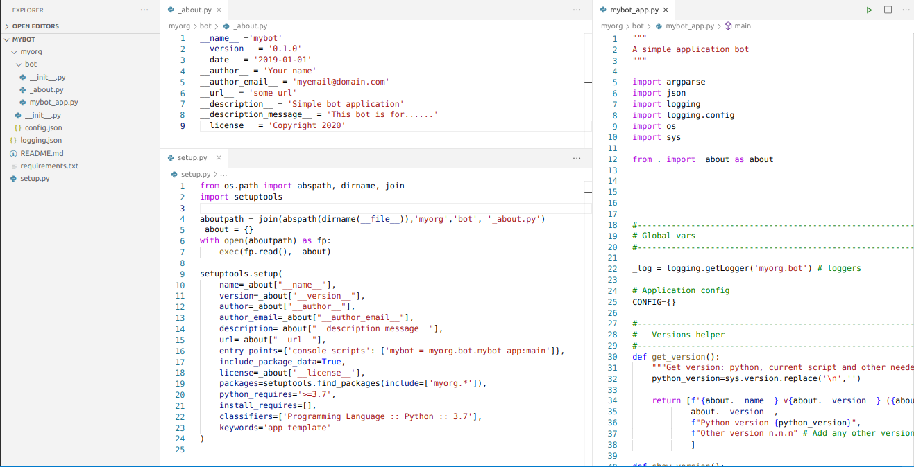

# Basic template

Basic template for python application

----

# What is is this?
Well, purpose is to provide a *simple* skeleton for application, including :

- Simple skeleton for app
- Command arg parse (argparse) (including common options: -h=help, -l=logging ,-c=configuration)
- Logging module (https://docs.python.org/3.9/library/logging.html)
- Installation (as module and script)


## How to use

- Clone sources 
```
# "mybot" application
git clone git@github.com:ktxo/main-template.git mybot
```

### Changes

You can apply all these changes or execute script [config_template.py](), see below 

- Rename the following according to your app:
    1. Package directories "ktxo/app" to something related to your app, for example: "myorg/bot" (for a "bot" app)
    2. Rename file [main_template.py](ktxo/app/main_template.py), for example: "mybot_app.py",
    3. Config file [_about.py](ktxo/app/_about.py)
    4. Config file [setup.py](setup.py)
        - Note the following line: 
          ```
          {'console_scripts': ['main_template = ktxo.app.main_template:main']}
          ```
           *main_template*: this name should be used to call your app from shell, for example:
          ```
          $> main_template --help
          ```
           *ktxo.app.main_template*: must match your configuration, for example:
           ```
          {'console_scripts': ['mybot = myorg.bot.mybot_app:main']}
          ``` 
    
  
    5. Add the code to *mybot_app.py*, **don't forget to change doc and logger name!**
    
- If you don't need a configuration file, remove the following lines:
    - Parse config option 
    ```
        parser.add_argument("-c", "--config",
                            help="Application configuration file")
    ```

    - Custom handler: init_cfg
    ```
    def init_cfg(args):
        ....
    ```
    - CONFIG dict
    ```
    CONFIG={}
    ```

- If you need a configuration , use [config.json](config.json) as a reference and add the required code to **init_cfg()** to handle the configuration
- Review command args for your app, see **parse_args()**
- Code your app
- Enjoy it!


### config_template.py

This script execute all the above changes for you, it will prompt for values, to execute :
``` 
# assuming that repo was cloned to "mybot"
$ cd mybot
$ python config_template.py

---------------------------------------------
---------------------------------------------
Please enter values (ENTER to use default or 'None' to empty):
proj_name (main_template)                         :app_sample
proj_version (0.1.0)                              :
proj_date (2021-11-19)                            :
proj_author (ktxo)                                :Me
proj_author_email (support@ktxo.com)              :support@me.com
proj_url (git@github.com:ktxo/main-template.git)  :None
proj_description (Application template)           :Sample application
proj_description_message (Brief description of this script):A more detailed description....
proj_license (Copyright 2020, Ktxo)               :Me, 2021
proj_app_script_name (main_template)              :app_main
app_package (ktxo.app)                            :me.sample
app_min_python (3.7)                              :3.9
app_keyword (app template)                        :app sample test
....
```
Then you can build and  install
``` 
$ python setup.py bdist_wheel
$ cd  dist ; pip install *whl;cd -
$ app_sample -v
app_sample v0.1.0 (2021-11-19) by Me
Python version 3.9.7 (default, Sep 10 2021, 13:09:58) [GCC 7.5.0]
Other version n.n.n

$ pip show app_sample
Name: app-sample
Version: 0.1.0
Summary: A more detailed edescription....
Home-page: UNKNOWN
Author: Me
Author-email: support@me.com
License: Me, 2021
Location: /sw/anaconda/envs/test/lib/python3.9/site-packages
Requires: 
Required-by: 
``` 

## Application installation and execution

- Build app 
``` 
# Build a wheel
cd myboot
python setup.py bdist_wheel
``` 
- Install app
``` 
# Install app
cd  dist ; pip install *whl;cd -

> pip list | grep mybot 
mybot                              0.1.0
> 
> pip show mybot
Name: mybot
Version: 0.1.0
Summary: This bot is for......
Home-page: some url
Author: Your name
Author-email: myemail@domain.com
License: Copyright 2020
Location: /sw/anaconda/lib/python3.8/site-packages
Requires: 
Required-by: 
```

- Run app
```
> mybot --version
mybot v0.1.0 (2019-01-01) by Your name
Python version 3.8.5 (default, Sep  4 2020, 07:30:14) [GCC 7.3.0]
Other version n.n.n

# or

    > python -m myorg.bot.mybot_app --version
mybot v0.1.0 (2019-01-01) by Your name
Python version 3.8.5 (default, Sep  4 2020, 07:30:14) [GCC 7.3.0]
Other version n.n.n

```